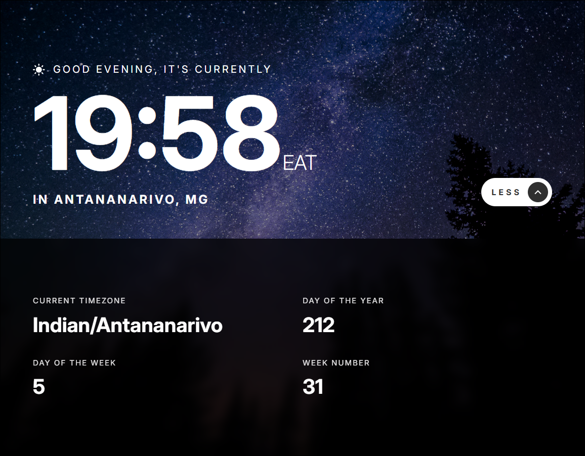

# Frontend Mentor - clock app

This is a solution to the [Clock app](https://www.frontendmentor.io/challenges/clock-app-LMFaxFwrM). Frontend Mentor challenges help you improve your coding skills by building realistic projects.

## Table of contents

- [Overview](#overview)
  - [The challenge](#the-challenge)
  - [Screenshot](#screenshot)
  - [Links](#links)
- [My process](#my-process)
  - [Built with](#built-with)
  - [What I learned](#what-i-learned)
- [Author](#author)

## Overview

### The challenge

Your users should be able to:

- View the current time and location information based on their IP address
- View additional information about the date and time in the expanded state
- Be shown the correct greeting and background image based on the time of day they're visiting the site
- Generate random programming quotes by clicking the refresh icon near the quote
- View the optimal layout for the site depending on their device's screen size
- See hover states for all interactive elements on the page

### Screenshot

### Links

- Solution URL: https://github.com/JairRaid/Clock-app
- Live Site URL: https://jairraid.github.io/Clock-app/

## My process

### Built with

- Semantic HTML5 markup
- React
- Tailwind
- Flexbox
- CSS Grid
- Mobile-first workflow

### What I learned

I learned to:

- Get current time, timezone, day of the week, day of the year, and week number using [WorldTimeAPI](https://timeapi.world/)
- Get the visitor's city and country using [IP Geolocation API](https://ipapi.co/)
- Get random quote using [Random Quotes API](https://github.com/lukepeavey/quotable)

## Author

- Email: rakotonirainyriija@gmail.com
- Facebook: https://web.facebook.com/jair.rakoto.3/
